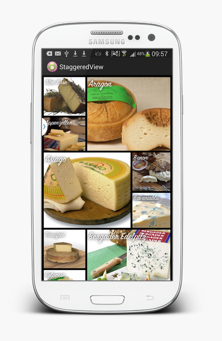
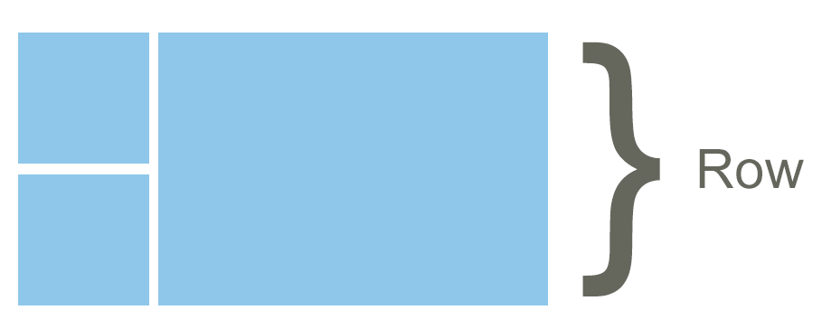
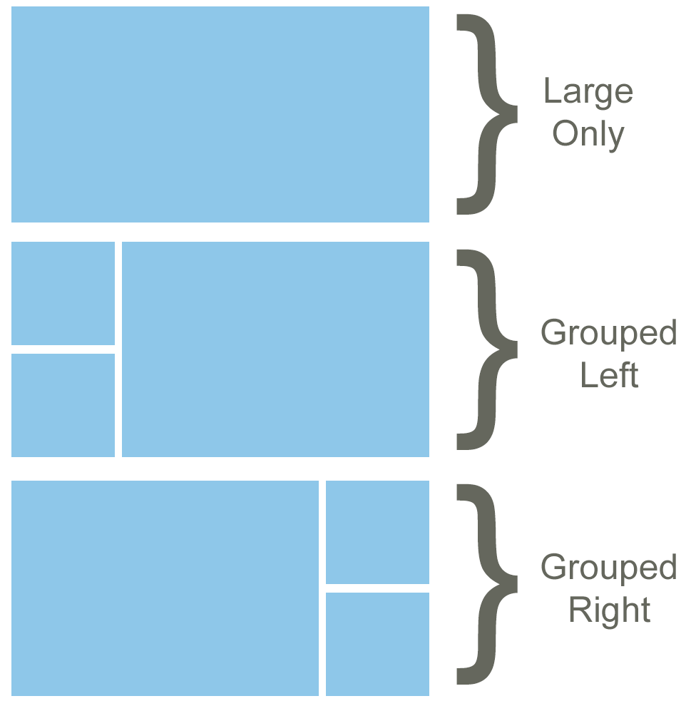
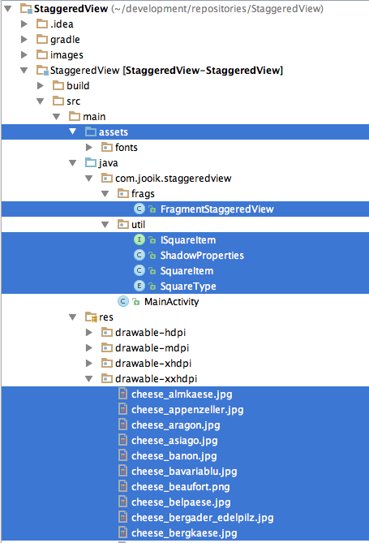

StaggeredView
=============

A simple staggered view for Android :-)

Hint: StaggeredView has been created within Android Studio - this guide describes how to integrate StaggeredView into your Android Studio project. Unfortunately currently AS (0.3.6) does not provide a smooth way of library integration (except you have ten hours left and already 'Master-Of-The-Gradle-Crap') so we quickly describe a programmatic way of embedding this staggered view...



# Quick introduction

In order to use StaggeredView you should be familar with the StaggeredView basic concepts, this enables you to easily extend the component to suit your needs…so let's get started!

There are three different "row" combinations which can occur within the StaggeredView component. A row is one/several images grouped horizontally…see picture below:



Within a row three different layouts might occurs: a large image only, two small images and a medium sized image (left) or a medium image followed by two small images, see image below:



# Embed StaggeredView

As already said, currently Android Studio and library/module usage is pain in the ass…so my recommendation: simply download this project from git, embed the project locally into your Android Studio and start copying the important parts to the project you wanna use StaggeredView. StaggeredView has been deisgned as a fragment component so there isn't that much copy pasting ;-) The nice thing about downloading the whole project: you have an "up&running" version in your workspace which you can use for experiments, modifications etc…

## Prepare your project

As already said, StaggeredView is a fragment component - so all you need to copy into your project in a first step is the layout file (layout/fragment_staggered_view.xml, paste it into your layout folder…) and the corresponding Java class java/com.jooik.staggeredview.frags.FragmentStaggeredView.java). 

Copy these items to your project and Android will start complaining about missing class files etc., in order to fix these issues of course you need the fragment "business logic", therefore copy&paste the whole java/com.jooik.staggeredview.util package into your project.

Nearly done. In case you wanna use our wonderful cheese images & sentico fonts you should copy main/assets and the drawable-xxhdpi cheese….png files to your project as well. 

Below I have pasted a screenie chalking out all required copy&paste parts:



## Embed StaggeredView

We expect that you are familar with the concepts of embedding fragments into an application…StaggeredView is embedded programmatically, you can do this for example within the **onCreate** method of your MainActivity:

```java
public class MainActivity extends ActionBarActivity {

    @Override
    protected void onCreate(Bundle savedInstanceState) {
        super.onCreate(savedInstanceState);
        setContentView(R.layout.activity_main);

        FragmentStaggeredView staggeredViewFragment = new FragmentStaggeredView();
        staggeredViewFragment.setItems(initItems());
        staggeredViewFragment.setPadding(15);
        staggeredViewFragment.setBackgroundColor("#000000");
        staggeredViewFragment.setAvoidDuplicateRandomLayouts(true);

        if (savedInstanceState == null) {
            getSupportFragmentManager().beginTransaction()
                    .add(R.id.container, staggeredViewFragment)
                    .commit();
        }
    }
    …
```

So what's happening here? Pretty simple…the FragmentStaggeredView is initialized and added to the activity window, there are several global parameters which can be passed to the staggered view in order to control it's look & feel. The *initItems()* method will be explained in a next steps as this is data generation for the StaggeredView.

Of course there need to be certain rules enabling you to populate StaggeredView with your own data, StaggeredView items simply need to implement the ISquareItem interface which enables items to define their look and feel. So all you need to do in order to render your own items is passing a list of items implementing the ISquareItem interface…below there is a demo snippet of creating a list of items:

```java
    /**
     * Generate some demo items...
     * @return
     */
    private List<ISquareItem> initItems()
    {
        Typeface face = Typeface.createFromAsset(getAssets(),
                "fonts/SignPainter_HouseScript.ttf");

        int font_large = 35;
        int font_medium = 28;
        int font_small = 20;
        int font_color = Color.WHITE;
        ShadowProperties shadowProperties = new ShadowProperties(30,0,0,Color.BLACK);

        List<ISquareItem> items = new ArrayList<ISquareItem>();
        SquareItem sq1 = new SquareItem("Alm-Käse",R.drawable.cheese_almkaese);
        sq1.applyFontStyle(font_large,font_medium,font_small,face,font_color,shadowProperties);
        items.add(sq1);
        SquareItem sq2 = new SquareItem("Appenzeller",R.drawable.cheese_appenzeller);
        sq2.applyFontStyle(font_large,font_medium,font_small,face,font_color,shadowProperties);
        items.add(sq2);
        SquareItem sq3 = new SquareItem("Aragon",R.drawable.cheese_aragon);
        sq3.applyFontStyle(font_large,font_medium,font_small,face,font_color,shadowProperties);
        items.add(sq3);
        SquareItem sq4 = new SquareItem("Asiago",R.drawable.cheese_asiago);
        sq4.applyFontStyle(font_large,font_medium,font_small,face,font_color,shadowProperties);
        items.add(sq4);
        SquareItem sq5 = new SquareItem("Banon",R.drawable.cheese_banon);
        sq5.applyFontStyle(font_large,font_medium,font_small,face,font_color,shadowProperties);
        items.add(sq5);
        SquareItem sq6 = new SquareItem("Bavariablu",R.drawable.cheese_bavariablu);
        sq6.applyFontStyle(font_large,font_medium,font_small,face,font_color,shadowProperties);
        items.add(sq6);
        SquareItem sq7 = new SquareItem("Beaufort",R.drawable.cheese_beaufort);
        sq7.applyFontStyle(font_large,font_medium,font_small,face,font_color,shadowProperties);
        items.add(sq7);
        SquareItem sq8 = new SquareItem("Belpaese",R.drawable.cheese_belpaese);
        sq8.applyFontStyle(font_large,font_medium,font_small,face,font_color,shadowProperties);
        items.add(sq8);
        SquareItem sq9 = new SquareItem("Bergader Edelpilz",R.drawable.cheese_bergader_edelpilz);
        sq9.applyFontStyle(font_large,font_medium,font_small,face,font_color,shadowProperties);
        items.add(sq9);
        SquareItem sq10 = new SquareItem("Bergkäse",R.drawable.cheese_bergkaese);
        sq10.applyFontStyle(font_large,font_medium,font_small,face,font_color,shadowProperties);
        items.add(sq10);

        return items;
    }
```

## Go Code!

Ok, basically that's all you need to know about StaggeredList - of course there is some more brain power behind StaggeredView, for example influencing random generation of row layouts etc. but that's documented pretty well in the Code so simply export JavaDoc and you should be able to dive into the magic of StaggeredView… ;-)

Have Fun!

[ ](https://twitter.com/_flomueller "Twitter")
